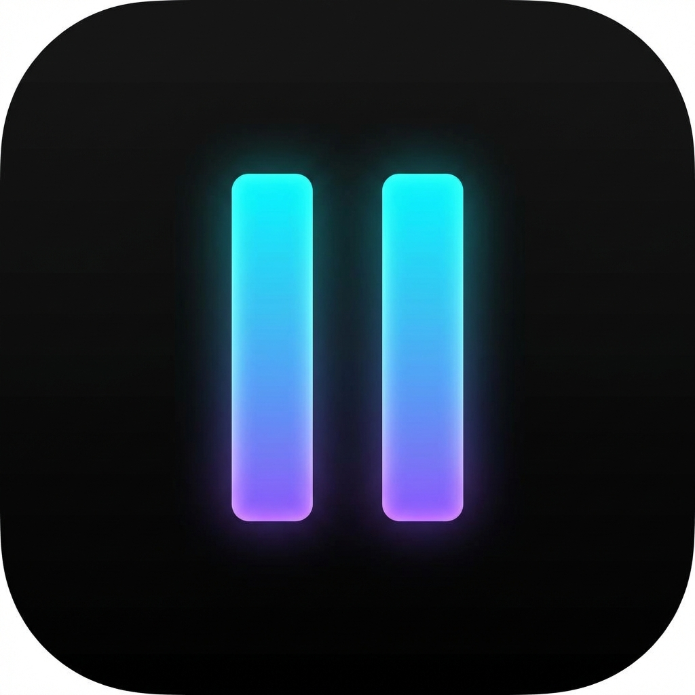

# 🌌 DarkPause

**The Unstoppable Distraction Killer.**

<p align="center">
  
</p>

DarkPause es una herramienta de **disciplina digital extrema** para Windows. Combina tres sistemas en una sola aplicación silenciosa que vive en tu bandeja de sistema:

1. ⏱️ **Limitador de plataformas** — Controla cuánto tiempo al día puedes usar Instagram, YouTube, etc.
2. 🔞 **Bloqueador permanente** — Bloquea 80 dominios de contenido adulto (40 sitios). Sin timer, sin desbloqueo.
3. 🌌 **Modo Focus (Blackout)** — Pantalla negra infranqueable en todos tus monitores por X minutos.

> _"La única forma de salir es esperar."_

---

## 🛡️ Capas de Protección

DarkPause no se limita a editar el hosts file. Usa un sistema multicapa inspirado en [SelfControl](https://github.com/SelfControlApp/selfcontrol) (macOS):

| Capa                     | Técnica                    | Qué bloquea                                 |
| ------------------------ | -------------------------- | ------------------------------------------- |
| **1. Hosts File**        | `127.0.0.1 dominio.com`    | DNS local del sistema                       |
| **2. DNS Anti-Bypass**   | Firewall rules (`netsh`)   | Google DNS, Cloudflare, OpenDNS, Quad9      |
| **3. DoT Lock**          | Bloqueo de puerto 853      | DNS-over-TLS                                |
| **4. Integrity Monitor** | Verificación cada 30s      | Tampering manual del hosts file             |
| **5. Persistent State**  | Estado en disco (JSON)     | Blackout sobrevive crashes/reinicios        |
| **6. Watchdog**          | Script AHK externo         | Resurrección automática si matan el proceso |
| **7. Allowlist Mode**    | Firewall Block-All + Allow | Solo dominios de trabajo permitidos         |

---

## 🔥 Características

- **🖥️ Multi-Monitor:** Detecta y bloquea automáticamente todos tus monitores.
- **📸 Platform Limiting:** Instagram (10 min/día), YouTube (60 min/día) con timer preciso.
- **🔞 Permanent Blocking:** 80 dominios de contenido adulto bloqueados 24/7.
- **🔒 DNS Anti-Bypass:** Bloquea DNS alternativos para que no puedas saltar el hosts file.
- **🔒 Lock Mode (Nuclear):** Blackout irreversible — una vez activado, NO se puede cancelar.
- **🔔 Multi-Step Warnings:** Notificaciones a los 5 min y 1 min restantes de cada plataforma.
- **🌐 Deep Work Mode (Allowlist):** Bloquea TODO internet excepto dominios esenciales de trabajo.
- **⏰ Schedules Recurrentes:** Programa bloqueos automáticos semanales (ej: Lunes-Viernes 9-17h).
- **🔄 Crash Recovery:** Si la app crashea durante un blackout, se reanuda automáticamente.
- **🛡️ Integrity Monitor:** Cada 30s verifica que nadie haya editado el hosts file.
- **🍅 Pomodoro Shortcuts:** Botones rápidos para flujos 25/5 y 50/10.
- **👻 Silent Operation:** Corre con `pythonw.exe` — sin ventana de consola.
- **🔑 Auto-Start:** Se registra en Task Scheduler para arrancar al encender el PC.

---

## 🏗️ Arquitectura

```
D:\Code Projects\dark_pause\
│
├── assets/                        # Recursos visuales
│   ├── icon.ico                   # Icono de la app
│   ├── icon.png                   # Icono PNG
│   └── screenshot.png             # Captura del panel de control
│
├── core/                          # Lógica de negocio (sin UI)
│   ├── __init__.py
│   ├── config.py                  # Plataformas, dominios, constantes
│   ├── hosts_manager.py           # Hosts file (atomic writes, markers)
│   ├── firewall_manager.py        # DNS lock + Allowlist mode via netsh
│   ├── scheduler.py               # Schedules recurrentes (JSON + thread)
│   ├── process_manager.py         # Detección y kill de procesos
│   ├── usage_tracker.py           # Tracking de uso diario (JSON)
│   └── icon_generator.py          # Iconos dinámicos para el tray
│
├── ui/                            # Interfaz
│   ├── __init__.py
│   ├── tray.py                    # System Tray (pystray) — proceso principal
│   ├── blackout.py                # Overlay fullscreen + persistent state
│   └── control_panel.py           # Panel de control (CustomTkinter)
│                                    Platform usage dashboard, task queue,
│                                    schedules, Deep Work toggle, Pomodoro
│
├── scripts/                       # Scripts de Windows
│   ├── launcher.ahk               # Ctrl+Alt+D → abre panel
│   └── watchdog.ahk               # Resucita el proceso si muere
│
├── darkpause.py                   # Entry point: admin, logging, init
├── run.bat                        # Launcher silencioso con UAC
├── install.bat                    # Auto-start + uninstall (Task Scheduler + Firewall)
├── requirements.txt               # pystray, Pillow, customtkinter, screeninfo
├── PLAN.md                        # Plan de migración y decisiones arquitectónicas
├── TROUBLESHOOTING.md             # Guía de resolución de problemas
├── README.md                      # Este archivo
└── LICENSE                        # MIT
```

---

## 🎮 Cómo se usa

### Uso desde el System Tray

DarkPause vive en tu **bandeja de sistema** (cerca del reloj). Haz clic derecho para:

- **▶ Iniciar / ⏸ Pausar** cada plataforma individualmente.
- **🍅 Pomo 25 / 🧘 Pomo 50** para sesiones rápidas de focus.
- **⚙️ Panel de Control** para programar sesiones y ver la cola de tareas.

### Uso desde el Panel de Control

1. Presiona **`Ctrl + Alt + D`** (requiere `launcher.ahk` activo).
2. Secciones disponibles:
   - **🔒 Plataformas:** Dashboard con barras de progreso por plataforma (verde/naranja/rojo según uso).
   - **📅 Programar Hora:** _"Bloquear a las 16:00 durante 60 minutos"._
   - **⚡ Quick Focus:** _"Bloquear en X minutos por Y minutos"_ + checkbox Lock Mode.
   - **🍅 Pomodoro:** Clic en `🍅 Pomo 25` o `🍅 Pomo 50` para work/break automático.
   - **⏰ Schedules:** Programa bloqueos recurrentes semanales (ej: L-V 9:00-17:00).
   - **🌐 Deep Work:** Toggle que bloquea TODO internet excepto dominios permitidos.
   - **📋 Cola de Tareas:** Lista visual de tareas pendientes con indicador de Lock 🔒.

---

## 🛠️ Instalación

### Requisitos

- **Python 3.10+**
- **Windows 10/11** (requiere privilegios de Administrador)
- **AutoHotkey v2.0+** (opcional, para hotkey y watchdog)

### Pasos

1. **Instalar dependencias:**

   ```bash
   pip install -r requirements.txt
   ```

   > ⚠️ **¿Tienes múltiples versiones de Python?** `install.bat` registra la primera `pythonw.exe` que encuentra. Asegúrate de instalar las dependencias con la **misma versión** que usa Task Scheduler. Verifica con: `schtasks /query /tn "DarkPause" /xml | Select-String "Command"`

2. **Ejecutar (primera vez):**

   ```bash
   # Opción A: Directo (aparecerá UAC)
   python darkpause.py

   # Opción B: Silencioso (sin consola)
   run.bat
   ```

3. **Auto-arranque al encender el PC (recomendado):**

   ```bash
   # Como Administrador:
   install.bat
   ```

4. **Activar hotkey Ctrl+Alt+D (opcional):**
   - Haz doble clic en `scripts/launcher.ahk`.
   - Para que se inicie con Windows: copia un acceso directo a `shell:startup`.

### Desinstalar

```bash
# Como Administrador — elimina task scheduler + firewall rules:
install.bat uninstall
```

---

## ⚙️ Configuración

Los límites de tiempo y dominios se configuran en `core/config.py`:

```python
INSTAGRAM = Platform(
    id="instagram",
    daily_limit_minutes=10,    # ← Cambia aquí
    domains=["instagram.com", "www.instagram.com", ...],
    ...
)

YOUTUBE = Platform(
    id="youtube",
    daily_limit_minutes=60,    # ← Cambia aquí
    domains=["youtube.com", "www.youtube.com", ...],
    ...
)
```

El reset diario ocurre a las **4:00 AM** (configurable via `RESET_HOUR`).

---

## ⚠️ Disclaimer

Esta herramienta está diseñada para usuarios que quieren comprometerse **seriamente** con su tiempo.

- **No hay botón de emergencia** en el blackout.
- **Las reglas de firewall persisten** entre reinicios.
- **El hosts file se restaura automáticamente** si lo editas manualmente.

Úsala con responsabilidad. Para desinstalarla completamente: `install.bat uninstall`.

---

## 🤝 Contribuciones

¡Este proyecto es **Open Source** y abierto a colaboraciones!
Si tienes ideas para funciones más extremas, abre un Issue o envía un PR.

## 📄 Licencia

Este proyecto está bajo la Licencia **MIT**.
