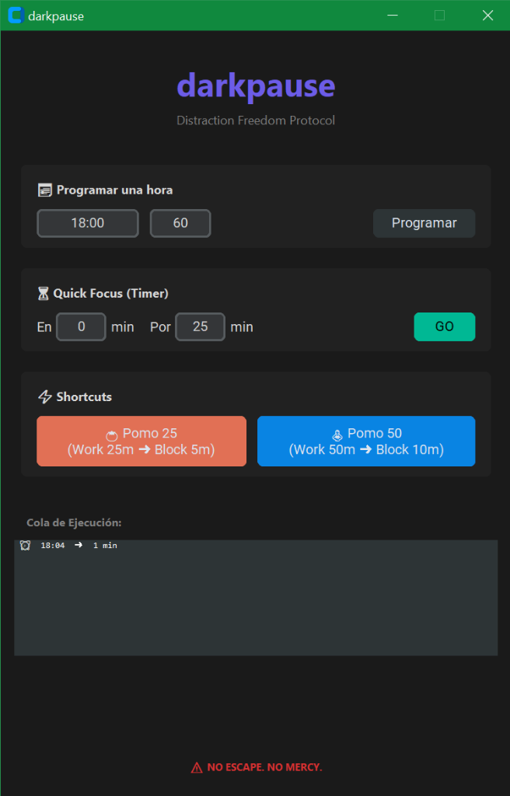

# 🌌 darkpause

**The Unstoppable Distraction Killer.**

<p align="center">
  
</p>

<p align="center">
  
</p>

Darkpause es una herramienta de disciplina digital extrema para Windows. Su objetivo es simple: **forzarte a desconectar o enfocarte eliminando cualquier distracción visual.**

Cuando se activa, despliega una capa negra infranqueable sobre **todos tus monitores**, bloquea el cierre del programa y vigila constantemente para evitar que lo elimines.

> _"La única forma de salir es esperar."_

---

## 🔥 Características

- **🖥️ Cobertura Total:** Detecta y bloquea automáticamente todos tus monitores (soporte multi-monitor nativo).
- **�️ Modo Ineludible:** Si intentas cerrar la app con el Administrador de Tareas, un proceso "Watchdog" de bajo nivel la resucita instantáneamente.
- **👻 Stealth Launcher:** Invoca la interfaz en cualquier momento con `Ctrl + Alt + D`.
- **� UI Moderna:** Interfaz minimalista y oscura (CustomTkinter).
- **🍅 Pomodoro Shortcuts:** Botones rápidos para flujos de trabajo de 25/5 y 50/10 minutos.

---

## 🎮 Cómo se usa

1.  Presiona **`Ctrl + Alt + D`**.
2.  Elige tu veneno:
    - **Quick Focus:** _"Bloquear por X minutos"_.
    - **Programado:** _"Bloquear a las 18:00 durante 1 hora"_.
    - **Shortcuts:** Clic en `🍅 Pomo 25` para una sesión estándar de trabajo/descanso.
3.  Di adiós a tu PC hasta que el timer llegue a cero.

---

## 🛠️ Instalación

Requisitos: Python 3.10+ y AutoHotkey v2.0+.

1.  **Instalar Dependencias:**

    ```bash
    pip install customtkinter screeninfo
    ```

2.  **Activar el Lanzador:**

    - Haz doble clic en el archivo `launcher.ahk`.
    - Verás una pequeña **H** verde en la bandeja de sistema. Ahora el atajo está activo.

3.  **Auto-Arranque (Opcional):**
    - Presiona `Win + R`, escribe `shell:startup` y pulsa Enter.
    - Crea un acceso directo de `launcher.ahk` dentro de esa carpeta.
    - _Listo, ahora darkpause protegerá tu productividad desde que enciendes el PC._

---

## ⚠️ Disclaimer

Esta herramienta está diseñada para usuarios que quieren comprometerse seriamente con su tiempo. **No hay botón de emergencia.** Úsala con responsabilidad.

---

## 🤝 Contribuciones

¡Este proyecto es **Open Source** y abierto a colaboraciones!
Si tienes ideas para funciones más extremas o mejoras de UI, siéntete libre de hacer un Fork y enviar tus Pull Requests.

## 📄 Licencia

Este proyecto está bajo la Licencia **MIT**. Puedes usarlo, modificarlo y compartirlo libremente.
